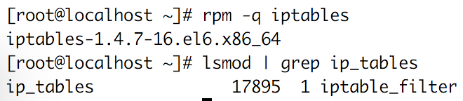

IPTables
=================

- CentOS에서는 일반적으로 iptables 라고 하는 강력한 기능의 방화벽이 내장되어 있다
(더 정확히는 iptables/netfilter).

- Iptables는 미리 정의된 chain이 존재하며, 이 체인에 각 패킷을 어떻게 처리할 지에 대해 결정한다.  
  1. chain
    - INPUT : 해당 호스트를 대상으로 하는 모든 패킷(호스트로 접속)
    - OUTPUT : 해당 호스트에서 발생한 모든 패킷(호스트에서 외부로 이동)
    - FORWARD : 모든 패킷이 호스트 컴퓨터를 대상으로 하지 않으며, 해당 호스트 컴퓨터를 라우팅하지 않고 호스트 컴퓨터를 통해 패킷을 전달

  2. 처리 방법
    - ACCEPT : 모든 패킷을 허용
    - DROP : 모든 패킷을 거부(삭제)

  3. 대표적인 iptables 설정 방법
    1. 모든 패킷을 DROP한 다음 신뢰할 수 있는 IP 주소 또는 웹 서버나 FTP 서버 등 특정 서비스의 포트를 허용(FTP, Web, Samba 등)
    2. 모든 패킷을 ACCEPT 한 다음 특정 IP 주소나 사용하지 않는 포트를 차단(DROP)
    - 일반적으로 옵션 1은 INPUT을, 옵션 2는 OUTPUT 체인에 사용

- Iptables 기본 사용
  - iptables 설치 확인 : rpm -q iptables
  - iptables module 동작 확인 : lsmod | grep ip_tables
  

  - 현재 iptables rule 확인 : iptables -L
  

  - iptables 기본 설정
    1. iptables -P INPUT ACCEPT : 임시로 들어오는 모든 패킷을 허용(Accept)
    2. iptables -F : 기존에 추가했던 iptables chain을 제거(Flush)
    3. iptables -A **INPUT** -i **lo** -j ACCEPT : -A 옵션을 이용하여 특정 chain에 규칙을 추가하고, -i 옵션을 이용하여 규칙을 적용할 인터페이스를 지정. -j 옵션은 대상 패킷에 지정(jump)
    4. iptables -A INPUT -p **tcp** --dport **22** -j ACCEPT : TCP 포트 22를 통한 연결을 허용(SSH)
    
    기타 iptables 옵션에 대한 예시 : [참고](https://wiki.centos.org/HowTos/Network/IPTables)
    5. (중요) service iptables save : 적용한 규칙들이 시스템 재시작 이후에도 유지될 수 있도록 저장

  - iptables 고급 설정
    1. Interface
      - iptables -A INPUT -i *< network-interface >* -j ACCEPT
      - 네트워크 인터페이스별로 다르게 구성할 경우 **-i** 옵션으로 인터페이스 지정
      - (중요)외부 인터페이스(ppp, tun 등)에 들어오는 패킷을 허용할 경우 기존 *eth* 와 같이 내부 인터페이스에 지정한 방화벽 정책이 적용되지 않음

    2. IP Addresses
      - 네트워크 인터페이스를 대상으로만 정책을 적용할 경우 접근을 허용하거나 거부하고자 하는 대상을 지정하기에 충분하지 않으므로, IP 주소를 기준으로 세부적인 방화벽 정책을 적용
      - iptables -A INPUT -s *< IP-ADDRESS >* -j ACCEPT|DROP: HOST-IP로부터 들어오는 모든 패킷을 허용/거부
      - iptables -A INPUT -s *< IP-ADDRESS >* -m **mac** **--mac-source** *< MAC-ADDRESS >* -j ACCEPT|DROP : *-m mac* 옵션으로 mac 모듈을 로드 한 다음, *--mac-source* 옵션으로 필터링 할 이더넷 장치의 MAC 주소를 지정

    3. Port and Protocols
      - 방화벽을 통해 허용할 패킷과 차단할 패킷을 프로토콜과 포트별로 세분화된 필터링
      - iptables -A INPUT **-p** *tcp* **-dport** *6881* ACCEPT|REJECT: 6881 포트를 사용하는 tcp 패킷을 허용/차단
      - iptables -A INPUT **-p** *tcp* **--dport** *6881:6890* -j ACCEPT : 6881 ~ 6990 포트를 사용하는 tcp 패킷을 허용/차단
