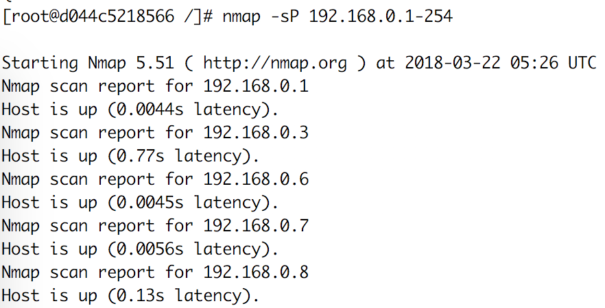
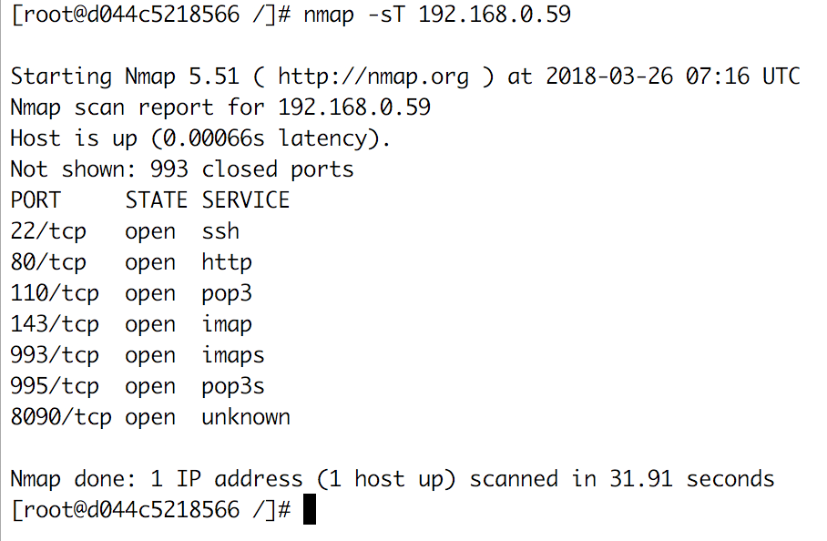

NMAP
================

## 컴퓨터와 서비스를 찾을 때 사용하는 보안 스캐너.
원격 컴퓨터의 운영체제, 장치 종류, 운영 시간, 서비스에 사용되는 소프트웨어 제품과 버전, 방화벽 등을 확인할 수 있음

설치 : yum install -y nmap

1. 호스트 탐지 : nmap -sP *< HOST-IP >*
  - 특정 호스트 또는 도메인 주소
  - IP 범위(예 - 192.168.0.1-254)
  
    
2. 포트 탐지 : nmap **- sT|sU**
  - sT : TCP 포트 탐지
  - sU : UDP 포트 탐지
  
