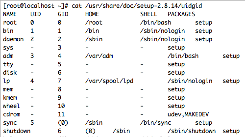

USER와 GROUP
=====

## 1. USER
- user ID(UID) 라는 고유한 숫자 번호로 식별, 특정 응용프로그램에서 사용하는 계정(파일 또는 폴더에 접근)

## 2. GROUP
- 공통된 목적을 위해 사용자를 묶는 조직 단위로 UID와 유사하게 group ID(GID)로 식별한다.
- 그룹 내의 사용자는 해당 그룹이 소유한 파일에 대한 읽기, 쓰기, 실행 권한을 얻을 수 있다.
- Red Hat Enterprise Linux는 시스템 사용자 및 그룹에 해당하는 reserved UID와 GID가 존재한다(0-500).
  - Reserved ID가 계속 증가할 수 있으므로 5,000애서 시작하는 예약되지 않은 ID를 할당하는 것을 권장한다.
  - 할당되는 기본 ID를 5,000에서 시작하려면 */etc/login.defs* 파일에서 **UID_MIN** 및 **GID_MIN** 값을 변경)
  - 새로운 UID 및 GID가 5,000으로 시작하는 경우에서도 reserved UID/GID를 500 이상으로 올리지 않는 것을 권장한다.
  

###### 각 사용자는 정확히 하나의 기본 그룹과 0개 이상의 추가 그룹(supplementary)의 구성원으로 등록한다.
###### 기본적으로 파일을 생성하면 파일 소유자는 작성자, 파일 그룹은 작성자의 기본 그룹으로 지정한다.
(*newgrp* 명령어를 이용하여 일시적으로 사용자의 기본 그룹을 변경 가능)
###### 추가 그룹은 특정 사용자 집합이나 해당 구성원, 특정 파일 집합, 이 그룹이 소유한 집합에 대한 접근 권한을 부여하는 역할을 지정한다.
###### 파일에는 소유자와 그룹 및 다른 모든 사용자에 대해 별도의 읽기와 쓰기 및 실행 권한이 할당되며, 파일 소유자는 루트 사용자만 변경할 수 있으며 루트 사용자와 파일 소유자가 접근 권한을 변경할 수 있음
###### 기본적으로 파일이나 디렉토리는 작성자만 수정할 수 있으며, 새로 생성된 파일이나 디렉토리에 권한을 결정하는 설정을 umask라고 부른다.
###### 사용자 인증을 위해서는 암호를 입력하며, 사용자 암호의 hash sum은 */etc/shadow*에, 생성된 계정의 기본값은 */etc/login.defs* 및 */etc/default/useradd* 에 저장된다.

----------------------------------------

## 사용자 추가

- 사용자 추가 : useradd *< username >*
- 패스워드 설정 : passwd *< password >*

## 그룹 추가

- 그룹 추가 : groupadd *< group-name >*

## 비밀번호 변경
- 보안상의 이유로 사용자가 정기적으로 암호를 변경하도록 요구하는 것이 바람직하다.
- shell에서 사용자 암호의 만료 여부를 설정하기 위해서는 *chage* 명령어를 이용한다.

  참고 : [chage 사용 예시](https://www.centos.org/docs/5/html/5.1/Deployment_Guide/s2-redhat-config-users-passwd-aging.html)
